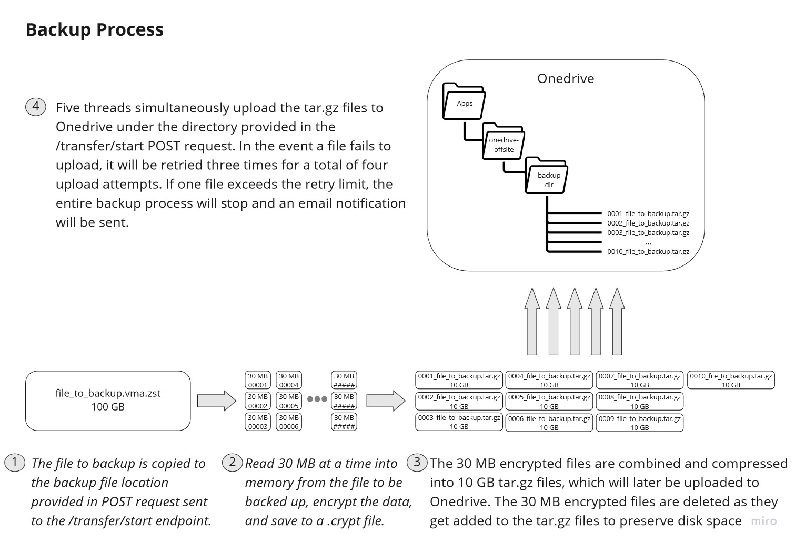

# onedrive-offsite

## Code coverage

[](https://git.swilsycloud.com/useful-apps-and-libraries/onedrive-offsite/badges/dev)
__DEV branch__
&nbsp; 

## Overview

onedrive-offsite is an application that encrypts backup files (ex: vma.zst from Proxmox) and pushes them to Microsoft Onedrive via the MS Graph API to create an offsite backup. This application uses a REST API to trigger encryption and offsite backup, as well as download and decryption. Once the offsite backup or download operation is completed successfully, or experiences an error, an email notification is sent using AWS SES.  

### Highlights
 - This is a containerized application that uses docker and a base image of python:3.10.1-slim-bullseye
 - The REST API uses Flask and gunicorn
 - Fernet encryption is used to both encrypt and guarantee that files are not modified
 - The sha256 hash of the original file to be backed up is calculated and stored to verify against during the download and decrypt process
 - How your encrypted backup will look in Onedrive
    - The directory provided in the initial POST request is created in Onedrive to house the backup files
    - The file being backed up is broken up into multiple encrypted and compressed tar.gz files
    - If your backup file is > 10 GB, it will be broken into multiple files at 10 GB each
    - During the download process, these tar.gz files will be downloaded, extracted, decrypted, and reassembled into the original backup file
 - Uploading and downloading is multi-threaded with five threads running simultaneously

### Table of contents
 - [How it works - backups](#how-it-works-for-backups)
 - [Install and setup guide](#install-and-setup-guide)
 - [API endpoints](#api-endpoints)
 - [Developing and testing](#developing-and-testing)
 - [Toplogy diagrams](#topology-diagrams)
 - [How to register an app in Microsoft Azure portal](#how-to-register-an-app-in-microsoft-azure-portal)
 - [Example bash scripts](#example-bash-scripts)

### How it works for backups
  
&nbsp;  


## Install and setup guide

### Prerequisites

To successfully deploy onedrive-offsite you will need the following:
 - A Microsoft account
     - This can be a hotmail.com account, live.com account, or whatever login you use for your Office 365 subscription
     - We need this for two reasons: 
         1. To register our application and use Oauth from Microsoft
         2. For accessing Onedrive
     - You can use the same Microsoft account for both of these purposes, but you don't have to. If you want to register the application with one account and store your offsite backups in the Onedrive storage of another account, that will work just fine.
 - An AWS account with SES and IAM user credentials with the proper permissions to send emails
     - This application uses the py-basic-ses library to provide email functionality. If you need help setting up AWS SES or IAM user permissions, checkout the <a href="https://github.com/shinyshoes404/py-basic-ses">py-basic-ses README on Github</a>.
     - You will need store your IAM access ID and secret key in one of these ways for the email functionality to work
         - As environment variables in the container (you would need to load the environment variables at runtime, possibly by modifying the docker-compose.yml file)
         - Save them in `~/.aws/credentials` for the default user in the container (this is the assumed method)
 - You'll need somewhere to run docker and the application container
     - This could be a VM or physical box
     - It will need to be able to access the files we want to backup directly on the docker host's filesystem, via a network share, or be able to send the files to this host via scp


### Register app with Microsoft

For an application to be able to use Microsoft's Graph API and Oauth, it first has to be registered in the Azure portal. This is how Microsoft keeps track of applications that are accessing its resources and asking Microsoft account holders to grant access. To register the application, go to <a href="https://portal.azure.com">portal.azure.com</a>, login with your Microsoft account, and register a new application. You will need the client ID and client secret created during registration to setup onedrive-offsite. For detailed instructions for registring an application with the Azure Portal, see the [How to - Register an app in Microsoft Azure Portal](#how-to-register-an-app-in-microsoft-azure-portal) section.

### Setup your environment
 - Setup a linux machine with docker and docker compose installed
 - Decide where on the docker host you want to store the files that need to be backed up. 
     - You will need to consider how much disk space is required to temporarily store the files you intend to backup, as well as intermediate files generated during the offsite backup process.
    - **Disk space requirements:** backup file size x 2.3
    - **Example:** if you have a 100 GB file you want to backup, you will need enough disk space to store a copy of the 100 GB file, plus enough space to temporarily store 130 GB during the encryptiong process.
    - The backup files that get sent to Onedrive will only be about 1% larger than the original backup files, but before compression the encrypted files are 30% larger than the originals.
    - **Note: Files to be backed up are deleted after the backup process runs - this shouldn't be your only copy of the files you want to backup.**
 - There are three likely scenarios for onedrive-offsite to access the files to be backed up:
    1. The files we want to backup to Onedrive are stored on the docker host machine that will run our onedrive-offsite application container and can easily be copied to the onedrive-offsite backup working directory
    2. Our docker host machine has access to a network share with the files we want to backup to Onedrive, and can easily copy the files to the working directory
    3. The files we want to backup to Onedrive are stored on a machine running on the same network as our docker host and we can transfer files to the application container using scp
 - See the [Topology diagrams](#topology-diagrams) secion below for a further illustration of possible enviroment configurations

### Build the docker image
 - Clone this project to your docker host machine
 - Edit the email information in src/onedrive_offsite/config.py
 - Review the Dockerfile
     - Set the timezone you want in the ENVS section
     - If you don't plan to send files directly to your onedrive-offsite container via scp, you could comment out the entire SSH section and modify the ENTRYPOINT to eliminate the ssh service restart and key gen.
 - Build the docker image
     - Move into the root of the onedrive-offsite project directory
     - Run `export DOCKER_BUILDKIT=1` to utilize docker buildkit
     - Run `docker build -t onedrive-offsite:latest .` to build the image (don't forget the '.' to indicate the current directory)
 

 ### Edit the docker-compose.yml file
 - DNS configuration
     - You can simply comment our or remove this section if you do not have specific dns requirements
 - services:volumes
     - You will notice two commented lines in this section and some corresponding commented lines in the volumes section at the end of the file
     - If you have plenty of disk space under /var/lib/docker/volumes on your docker host machine, then you can just leave these lines commented out
     - If the files you will be backing up to Onedrive are very large (maybe 100 GB or more), and you want to use a separate disk or external USB drive to house the initial copy of the backup file plus intermediate files during the encryption process. If this is the case, then you would uncomment the appropriate lines related volumes and modify the device declaration.


### App setup
 - Start the application container on the docker host machine by running `docker-compose up -d` in the root of the onedrive-offsite project directory
 - Access your container's terminal `docker exec -it your_container_name bash`
 - Add your AWS IAM credentials for SES to `/home/onedriveoffsite/.aws/credentials` following this format
    ```
    [default]
    aws_access_key_id = your-access-key-here
    aws_secret_access_key = your-secret-access-key-here
    ```  
 - Generate your encrpytion key
    - Run the `onedrive-offsite-create-key` command
    - This will create the symmetric encryption key used to protect the files we will backup to Onedrive. Becasue this is a symmetric key, you should treat it like you would a password.
    - You will want to save a copy of the key you just created in the event your docker host machine has a catasrophic failure, and you have to setup onedrive-offsite on a new machine. The key is saved in `/etc/onedrive-offsite/onedrive-offsite.key`
    - Note that the /etc/onedrive-offsite directory is mapped to a docker volume so that the key will persist between container restarts.
 - Setup your app configuration
    - Make sure you have your app client ID and client secret handy from the app registration process
    - Run `onedrive-offsite-setup-app` and follow the prompts
 - Sign in to Microsoft to authorize access to Onedrive
    - Run `onedrive-offsite-signin` and follow the prompts
    - You will need to copy + paste the sign in URL into a web browser. After signing in with Microsoft, you will see a screen describing the permissions you are granting. Once you grant permission, you will be redirected to http://localhost:8080, which your browser will say cannot load (we aren't running an http server on port 8080). What you need is the code provided after the `?code=` in the URL.  
    **Grant permissions**  
          
    &nbsp; 
    **Copy the code from the URL**  
          
    &nbsp;   

 - SSH key
    - If you intend to send files to the application container using scp, you will need to grab the ssh key generated during the docker image build.
    - Still in the container's terminal, navigate to `/home/onedrivefile/.ssh` and copy the contents of id_rsa. This is the key file you will use in your scp command.
    - **Tip:** To make sure that any automated scripts using scp run smoothly without manual intervention, it is recommended that you run `ssh -i /path/to/id_rsa -p 2022 onedrivefile@docker-host-address` on whatever machine and with whichever user you will be sending files from via scp, replacing /path/to/id_rsa and docker-host-address with the appropriate values. This will add the app container to that machine's known hosts file. 

### Create a backup cron job  
Now that the application is up and running, we need a way to to initiate the backup process and copy the file you want to backup. The easiest way to handle this is with a bash script and a cron job. See the [Example bash scripts](#example-bash-scripts) section for example scripts.

## API endpoints
 - Backup
    - /transfer/start
        - Initiates the backup process
        - Method: POST
        - Request body
        ```
        {
            "file-path":"/path/to/file/to/backup",
            "username":"user-copying-file-for-backup",
            "size-bytes": 157834,
            "onedrive-filename":"file-name-to-save-in-onedrive",
            "onedrive-dir":"dir-to-save-backup-files-in-onedrive"
        }    
        ```
    - /transfer/done
        - Indicates that the file we want to backup is now where it needs to be and the encryption and backup process can begin
        - Method: PUT
        - Request body: None
 - Download
    - /download-decrypt
        - Downloads, decrypts, and reassembles the backup file based on the Onedrive directory provided
        - Method: POST
        - Request body
        ```
        {
            "onedrive-dir":"dir-with-backup-files-download-and-decrypt"
        }
        ```

## Developing and testing

### Install for development
 
 - Clone this project to your machine
 - Create a python virtual environment with python 3.10 installed
 - Install onedrive-offsite with dev dependencies by running `pip install -e .[dev]` in the project root directory
 - Set an environment variable to indicate this is a development environment `export ONEDRIVE_ENV=dev`

### Test commands

 - Run the suite of unit tests and record test coverage for reporting with `coverage run --source=src -m unittest discover -v -s tests/unit`
 - Run the suite of integration tests and add coverage results to those captured during the unit test execution with `coverage run -a --source=src -m unittest discover -v -s tests/integration`

### Other helpful commands

 - Get file size in bytes in bash shell `stat -c %s file_we_want_size_in_bytes_of`
 - Example curl commands when developing on a Windows machine and running the app locally with the flak development server - assumes the file you want to backup is located at `C:\Users\yourusername\Documents\Dev\onedrive-offsite\test_backup_file.tar` and is 150000 bytes
     - Initiate the backup process `curl  -d '{"file-path":"C:\\Users\\yourusername\\Documents\\Dev\\onedrive-offsite\\test_backup_file.tar","username":"yourusername","size-bytes": 150000,"onedrive-filename":"offsite_test_backup.tar.gz", "onedrive-dir":"offsite_test_backup"}' -H 'Content-Type:application/json' -X POST http://localhost:5000/transfer/start`
     - Indicate that the file you want sent to Onedrive has finished copying to the file location specified in the initiation request and is ready to start the encryption and backup process `curl  -H 'Content-Type:application/json' -X PUT http://localhost:5000/transfer/done`
     - Download, decrypt, and reassemble the backup saved to Onedrive `curl  -d '{"onedrive-dir":"offsite_test_backup"}' -H 'Content-Type:application/json' -X POST http://localhost:5000/download-decrypt`

## Topology diagrams

**Files on docker host**  
   
 &nbsp;  

**Network share on docker host**  
   
 &nbsp;  

**scp files to contiainer**  
   
 &nbsp;  

## How to register an app in Microsoft Azure portal

To register your implementation of onedrive-offsite, follow these steps
 - Go to portal.azure.com and login to the Azure portal with your Microsoft account  
      
 &nbsp;
 - Search for `app registrations` in the search bar at the top  
      
 &nbsp;
 - Click the `Register an application` button  
      
 &nbsp; 
 - Enter an application name, `Personal Microsoft accounts only` as the supported account types, and a web redirect URI of localhost. Then click the register button.  
      
 &nbsp; 
 - Copy the application's client ID and store is somewhere for later. Click the `Add a certificate or secret` link.    
      
 &nbsp; 
  - Click `New client secret`     
      
 &nbsp; 
  - Enter a description for the client secret and choose when the secret will expire, then click `Add`.  
      
 &nbsp; 
  - Copy the client secret and save it for later. Treat this secret as you would a password.  
      


## Example bash scripts


**Example 1: Copy files to container with scp**
 - Assumes the file we want to backup is on a separate machine from the docker host running our app container and we want to send the file to the container using scp
 - Stores script output to a log file which rotates automatically
 - You will need to modify the SET VARIABLES section to suite your environment
 - Assumes there are multiple versions of the file we want to backup in a directory, and we want to backup the most recent version

    ```
    #!/bin/bash

    log_location=/var/log/onedrive-offsite
    # send stdout and stderr to a log file
    exec 3>&1 4>&2 1>> $log_location 2>&1

    # print date with hours minutes and seconds in the log file
    echo "----------------$(date '+%Y-%m-%d %H:%M:%S') Starting onedrive-offsite file send-----------------"

    ### -------- SET VARIABLES -------- ###

    # set a variable for the file we want to sent for offsite backup
    # look for the newest file in that meets the criteria provided in the ls command
    file_path=$(ls -t /mnt/backup_files/*.vma.zst | head -n1)

    # just the file name (no leading path)
    file=$(ls -t /mnt/backup_files/*.vma.zst | head -n1 | xargs -n 1 basename)

    # host we are sending the backup file to
    host=docker-host-name-or-ip-addr

    # scp port
    scp_port=2022

    # where is the file going to to be saved on the machine we are sending it to
    scp_path="~/backup_files/"

    # which user is sending the file via scp
    scp_user=onedrivefile

    # set the file path for the ssh key stored on this machine
    ssh_key=/etc/onedrive-offsite/onedrivefile_id_rsa

    # set a variable for the size of the file in bytes that we are sending (need for POST request)
    file_size=$(stat -c%s $file_path)

    # set the name of the file that will show up in Onedrive
    upload_filename=offsite_backup.tar.gz

    # set the name of the sub directory we want to store our offsite files in
    onedrive_dir=offsite_backup


    ### -------- INITIATE TRANSFER WITH POST REQUEST TO API -------- ###

    # send reqest to onedrive-offsite api to initiate the file transfer - note: the onedrive-filename parameter is optional. if not provided, the default filename set in the onedrive-offsite app will be used
    curl  -d '{"file-path":"'"$scp_path$file"'","username":"'"$scp_user"'","size-bytes":'"$file_size"',"onedrive-filename":"'"$upload_filename"'","onedrive-dir":"'"$onedrive_dir"'"}' -H 'Content-Type:application/json' -X POST http://$host:8000/transfer/start

    # spacing in log file
    printf "\n"


    ### -------- SEND OUR FILE TO ONEDRIVE OFFSITE SERVER VIA SCP -------- ###
    echo "$(date '+%Y-%m-%d %H:%M:%S') scp starting to send file: $file_path file-size: $file_size"

    # send our file via scp
    scp -i $ssh_key -P $scp_port  $file_path $scp_user@$host:$scp_path

    echo "$(date '+%Y-%m-%d %H:%M:%S') scp complete"

    # spacing in log file
    printf "\n"

    echo "Changing file permissions on remote machine"
    ssh -i $ssh_key -p $scp_port $scp_user@$host "chmod 666 $scp_path$file"

    # spacing in log file
    printf "\n"

    ### -------- FINISH FILE TRANSFER BY SENDING A PUT REQUET TO THE API -------- ###

    # send reqest to onedrive-offsite api to finish process
    curl  -H 'Content-Type:application/json' -X PUT http://$host:8000/transfer/done

    #Add a space at the end of this section in the log file
    printf "\n"
    printf "\n"


    ### -------- LOG FILE MANAGEMENT -------- ###

    # if the log file is larger than 1 M, copy it to onedrive-offsite.1 and clear out the current log
    maxsize=1000000
    currentsize=$(wc -c < $log_location)
    if [ $currentsize -ge $maxsize ]; then
        cp $log_location $log_location.1
        echo "" > $log_location
    fi


    # stop logging and print complete to the terminal
    exec 1>&3 2>&4
    echo >&2 "complete"
    ```

**Example 2: Copy files on docker host locally**
 - Assumes that this script runs on the docker host running the app container and the file we want to backup is available on the docker host as well
 - Stores script output to a log file which rotates automatically
 - You will need to modify the SET VARIABLES section to suite your environment
 - Assumes there are multiple versions of the file we want to backup in a directory, and we want to backup the most recent version

    ```
    #!/bin/bash

    log_location=/var/log/onedrive-offsite
    # send stdout and stderr to a log file
    exec 3>&1 4>&2 1>> $log_location 2>&1

    # print date with hours minutes and seconds in the log file
    echo "----------------$(date '+%Y-%m-%d %H:%M:%S') Starting onedrive-offsite file send-----------------"

    ### -------- SET VARIABLES -------- ###

    # set a variable for the file we want to sent for offsite backup
    # look for the newest file in that meets the criteria provided in the ls command
    file_path=$(ls -t /mnt/backup_files/*.vma.zst | head -n1)

    # just the file name (no leading path)
    file=$(ls -t /mnt/backup_files/*.vma.zst | head -n1 | xargs -n 1 basename)

    # host for onedrive-offsite
    host=localhost

    # where is the file going to to be saved in the container
    backup_copy_path="~/backup_files/"

    # which user will access the file in the container
    copy_user=onedrivefile

    # set a variable for the size of the file in bytes that we are sending (need for POST request)
    file_size=$(stat -c%s $file_path)

    # set the name of the file that will show up in Onedrive
    upload_filename=offsite_backup.tar.gz

    # set the name of the sub directory we want to store our offsite files in
    onedrive_dir=offsite_backup

    # copy to path on docker host that is mappped to the right location in the container
    backup_mapped_path="/mnt/onedrive-offsite/backup_files/"


    ### -------- INITIATE TRANSFER WITH POST REQUEST TO API -------- ###

    # send reqest to onedrive-offsite api to initiate the file transfer - note: the onedrive-filename parameter is optional. if not provided, the default filename set in the onedrive-offsite app will be used
    curl  -d '{"file-path":"'"$backup_copy_path$file"'","username":"'"$copy_user"'","size-bytes":'"$file_size"',"onedrive-filename":"'"$upload_filename"'","onedrive-dir":"'"$onedrive_dir"'"}' -H 'Content-Type:application/json' -X POST http://$host:8000/transfer/start

    # spacing in log file
    printf "\n"


    ### -------- COPY OUR FILE TO THE LOCATION ON DOCKER HOST MAPPED TO THE RIGHT LOCATION IN THE CONTAINER -------- ###
    echo "$(date '+%Y-%m-%d %H:%M:%S') copy starting to copy file: $file_path file-size: $file_size"

    # copy the file to the mapped volume location
    cp $file_path $backup_mapped_path

    echo "$(date '+%Y-%m-%d %H:%M:%S') copy complete"

    # spacing in log file
    printf "\n"

    echo "Changing file permissions"
    chmod 666 $scp_backup_mapped_path$file"

    # spacing in log file
    printf "\n"

    ### -------- TELL THE APP THAT THE COPY IS COMPLETE BY SENDING A PUT REQUET TO THE API -------- ###

    # send reqest to onedrive-offsite api to finish process
    curl  -H 'Content-Type:application/json' -X PUT http://$host:8000/transfer/done

    #Add a space at the end of this section in the log file
    printf "\n"
    printf "\n"


    ### -------- LOG FILE MANAGEMENT -------- ###

    # if the log file is larger than 1 M, copy it to onedrive-offsite.1 and clear out the current log
    maxsize=1000000
    currentsize=$(wc -c < $log_location)
    if [ $currentsize -ge $maxsize ]; then
        cp $log_location $log_location.1
        echo "" > $log_location
    fi


    # stop logging and print complete to the terminal
    exec 1>&3 2>&4
    echo >&2 "complete"
    ```